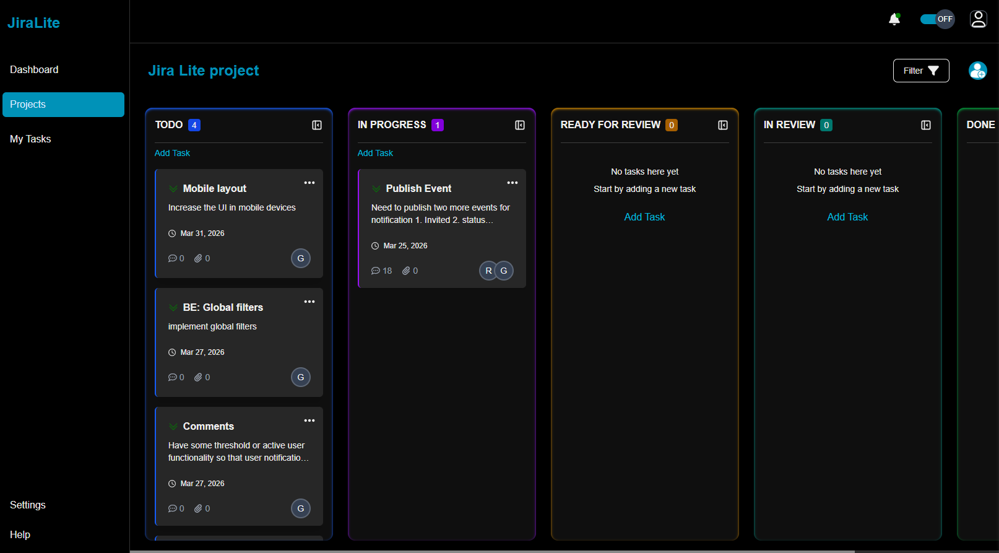
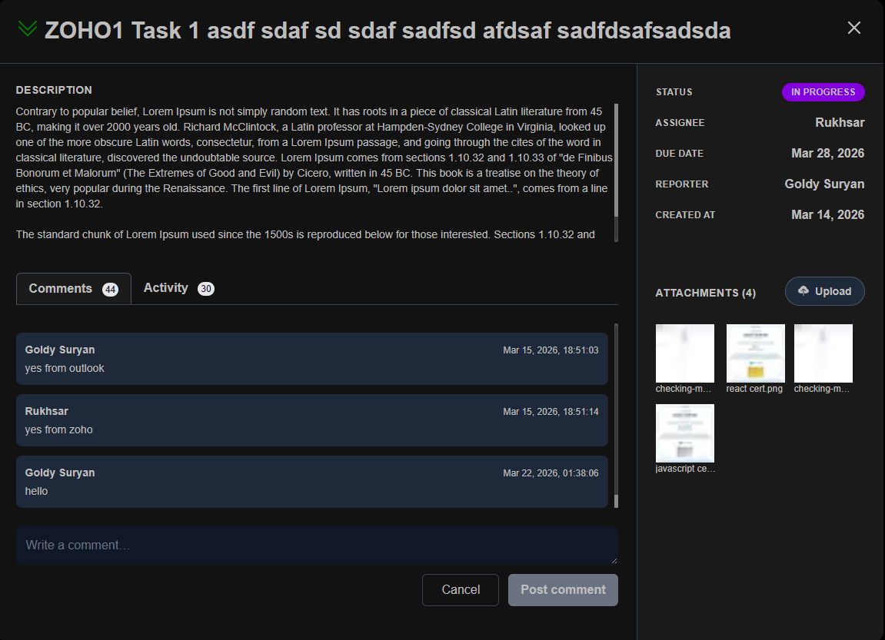
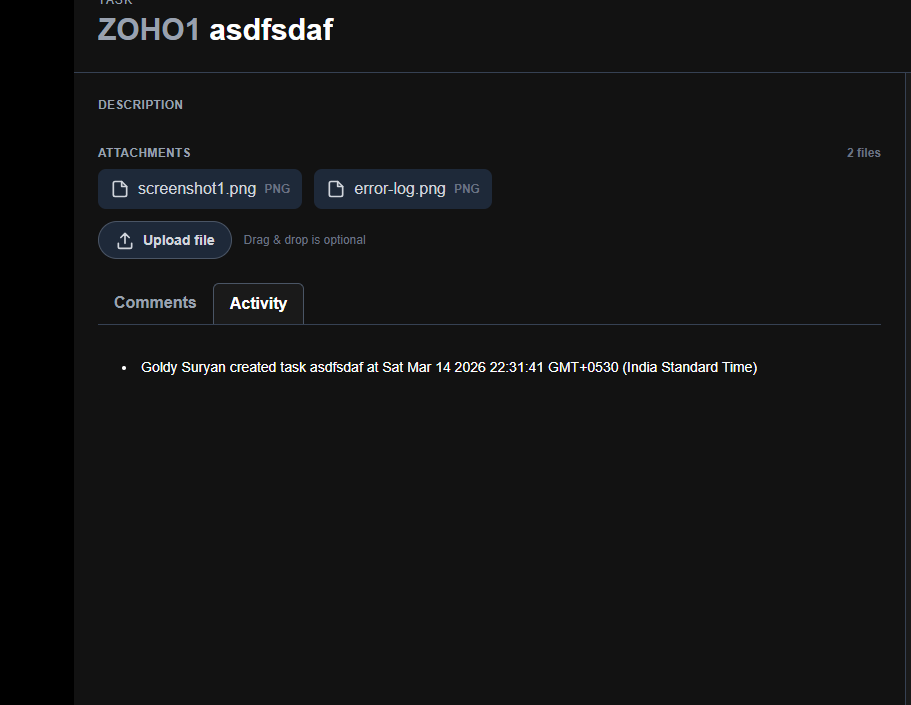

# Jira Lite 🚀
#### Node.js | GraphQL | PostgreSQL | Redis | Next.js | AWS S3

A lightweight Jira-inspired project management tool built with a modern **MERN + GraphQL** stack.
It supports **real-time collaboration, task management, activity tracking, and team-based project workflows.**

This project was built as a **full-stack system design practice**, focusing on scalable architecture, real-time communication, and production-ready backend patterns.

---

# ✨ Features

### Project Management

* Create and manage projects
* Invite members to projects
* Accept / decline invitations
* Project-based access control

### Task Management

* Create tasks with title, description, priority and due date
* Assign tasks to project members
* Drag & drop tasks across columns (Kanban board)
* Automatic task positioning algorithm

### Real-Time Collaboration

* Real-time task comments using **GraphQL Subscriptions**
* Real-time updates for multiple users

### Activity Feed

* Automatic activity logging for:

  * Task creation
  * Task updates
  * Status changes
  * Assignment changes

### Attachments (S3 Integration - WIP)

* File attachments for tasks
* Secure upload using signed URLs

### Authentication

* JWT-based authentication
* Secure login system
* Centralized error handling

---

# 🖼 Screenshots

### Kanban Board



### Task Detail with Comments tab



### Activity Feed



---

# 🏗 Architecture

```
Frontend (Next.js + Apollo Client)
        │
        │ GraphQL
        ▼
Backend (Node.js + Express + Apollo Server)
        │
        ├── PostgreSQL (Sequelize ORM)
        │
        ├── Redis Pub/Sub
        │      └── GraphQL Subscriptions
        │
        └── AWS S3 (File Uploads)
```

---
# 🧩 System Design

This project was designed to mimic real-world project management tools like Jira while keeping the architecture modular and scalable.

### High Level Architecture

Frontend communicates with the backend using GraphQL. The backend manages business logic through service layers and interacts with PostgreSQL using Sequelize ORM.

Real-time communication is implemented using GraphQL subscriptions backed by **Redis Pub/Sub** (used as a distributed event bus for GraphQL subscriptions).

File uploads are handled via AWS S3 using signed URLs to avoid routing large files through the backend server.

```
Client (Next.js)
      │
      │ GraphQL
      ▼
Apollo Server (Node.js + Express)
      │
      ├── PostgreSQL
      │       └── relational data (projects, tasks, activities)
      │
      ├── Redis
      │       └── pub/sub for GraphQL subscriptions
      │
      └── AWS S3
              └── file storage
```

---

## Database Design

The system uses relational modeling with junction tables to manage many-to-many relationships.

Example:

Users ↔ Projects (Many-to-Many)

```
users
projects
user_project_junction
```

Tasks belong to a project and may be assigned to a user.

```
projects
   │
   └── tasks
           │
           ├── comments
           └── activities
```

---

## Real-Time Communication

Real-time updates for comments are implemented using GraphQL subscriptions.

To allow scalability across multiple server instances, Redis Pub/Sub is used as the event transport layer.

```
Client A comment
        │
        ▼
GraphQL Mutation
        │
        ▼
Redis Pub/Sub
        │
        ▼
GraphQL Subscription
        │
        ▼
Client B receives comment instantly
```

---

## Task Positioning Strategy

Tasks are ordered using a **fractional indexing approach** to avoid reordering the entire list during drag-and-drop operations.

Example:

```
TODO column

Task A  → position 10000
Task B  → position 20000
Task C  → position 30000
```

When a new task is inserted between A and B:

```
New Task → position 15000
```

This approach significantly reduces database writes during drag-and-drop operations.

---

## Error Handling Strategy

Error handling is centralized using GraphQL error formatting.

Frontend interceptors display user-friendly error notifications, while backend services throw domain-specific errors.

This keeps the service layer clean while maintaining consistent error responses across the application.

---

## Scalability Considerations

The system is designed with scalability in mind:

• Stateless backend architecture
• Redis-based pub/sub for horizontal scaling
• Direct S3 uploads using signed URLs
• Service layer abstraction for maintainability

These patterns allow the application to scale to multiple backend instances behind a load balancer.


---

# 🧠 Technical Highlights

### GraphQL Architecture

* Modular resolver structure
* Service layer abstraction
* Centralized error handling

### Database Design

* PostgreSQL relational schema
* Junction tables for many-to-many relations
* Activity logging system

### Real-Time System

* GraphQL subscriptions using Redis Pub/Sub
* Multi-instance scalable architecture

### Drag & Drop Optimization

* Fractional indexing strategy for task positions
* Avoids full list reordering

---

# 🛠 Tech Stack

Frontend

* Next.js
* React
* Apollo Client
* TailwindCSS
* Redux-toolkit

Backend

* Node.js
* Express
* Apollo Server (GraphQL)

Database

* PostgreSQL
* Sequelize ORM

Real-Time

* Redis
* GraphQL Subscriptions

Storage

* AWS S3 (signed URL uploads)

---

# 📂 Project Structure

```
backend
└── src
    ├── config
    │   ├── email.config.ts
    │   ├── pubSub.config.ts
    │   ├── sequelize.init.ts
    │   └── webSocket.config.ts
    ├── graphql-schema
    │   ├── resolvers
    │   ├── rootMutation.ts
    │   ├── rootQuery.ts
    │   ├── rootSubscription.ts
    │   ├── schema.ts
    │   └── typeDef.ts
    ├── models
    │   ├── index.ts
    │   └── userProject.model.ts
    ├── modules
    │   ├── activity
    │   │   ├── activity.controller.ts
    │   │   ├── activity.model.ts
    │   │   └── activity.service.ts
    │   ├── comment
    │   ├── invitation
    │   ├── project
    │   ├── task
    │   └── user
    ├── services
    ├── utils
    ├── app.ts
    ├── server.ts
    ├── access.log

frontend
├── app
│   ├── (auth)
│   │   ├── components
│   │   ├── login
│   │   └── register
│   ├── (board)
│   │   ├── components
│   │   ├── dashboard
│   │   ├── projects
│   │   │   ├── [projectId]
│   │   │   │   └── page.tsx
│   │   │   └── components
│   │   │       └── page.tsx
│   │   └── tasks
|   |   ├── layout.tsx
│   
├── graphql
│   ├── mutations
│   ├── queries
│   ├── subscriptions
│   └── types
├── invite
├── lib
│   ├── apollo-client.ts
├── settings
├── state
│   ├── features
│   ├── hooks.ts
│   └── store.ts
├── utils
├── globals.css
├── layout.tsx
├── page.tsx
├── storeProvider.tsx
├── proxy.ts

```

---

# ⚙️ Installation

#### Clone the repository

```
git clone https://github.com/goldy-suryan/jira-lite.git
```

#### Install dependencies

```
cd backend
npm install

cd ../frontend
npm install
```
#### Create environment variables:
backend/.env
```
PORT=
JWT_SECRET=
SEQUEL_USERNAME=
SEQUEL_DATABASE=
SEQUEL_PASSWORD=
MAIL_USER=
MAIL_PASS=
FRONTEND_URL=
```
---

#### Start Redis

This project uses Redis for GraphQL subscriptions.

If Redis is installed locally:
```
redis-server
```

#### Start backend server

```
npm run dev_server
```

#### Start frontend

```
npm run dev
```

---

# 🔮 Upcoming Improvements

* File uploads with AWS S3
* Notifications system
* Role-based access controls (Admin / Member / Viewer)
* Activity filtering
* Full-text search for tasks
* WebSocket-based presence indicators

---

# 🎯 Learning Goals

This project focuses on:

* GraphQL architecture
* Real-time communication
* Scalable backend design
* Database modeling
* Production-grade patterns

---

# 👨‍💻 Author

Goldy Suryan
Senior Software Developer (MERN / MEAN)

GitHub: https://github.com/goldy-suryan
